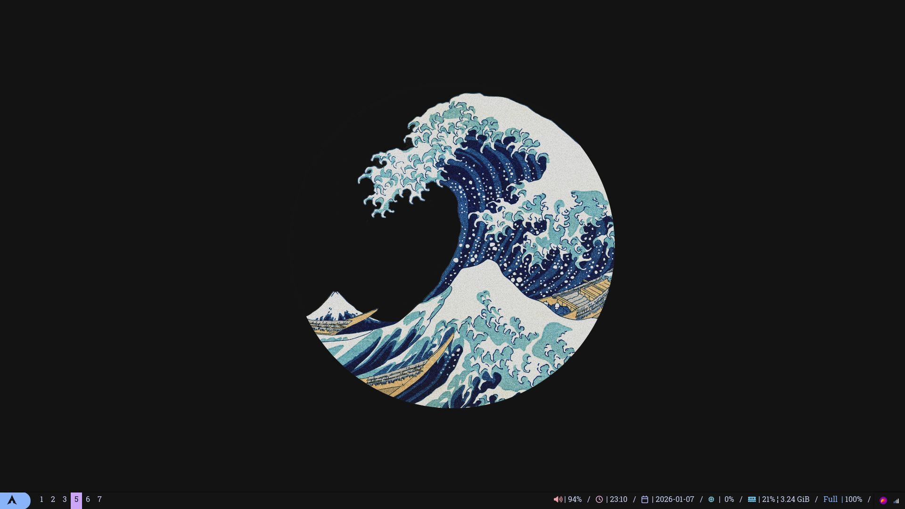
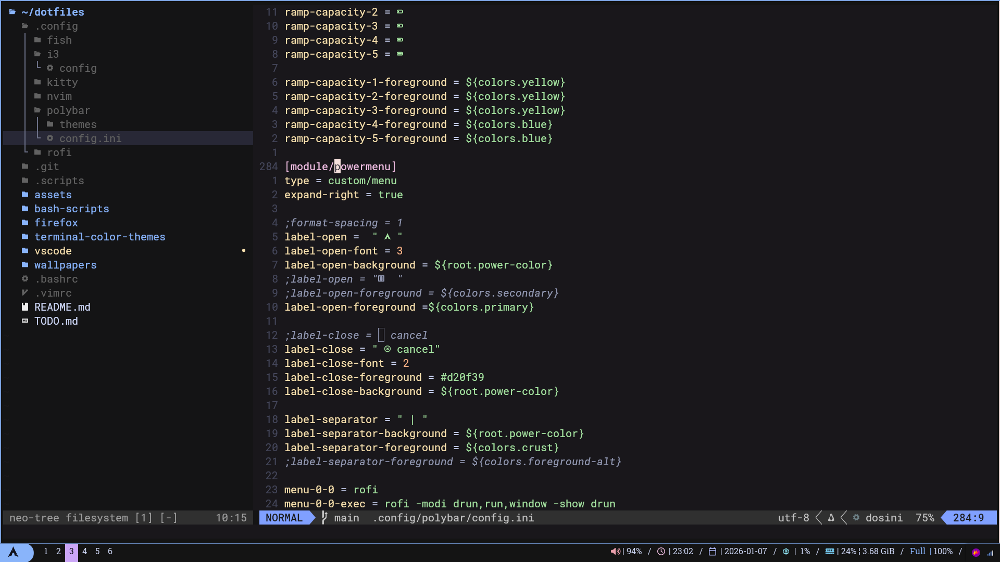
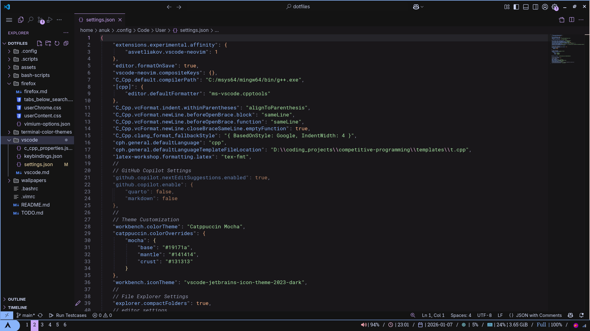

# My .files

[what's a dotfile?](https://wiki.archlinux.org/title/Dotfiles)

These are my dotfiles

They are made for ubuntu with gnome and i3 but they will probably work with anything  

# gallery

## desktop


## terminals


## neovim



## vscode



## rofi (launcher)


## firefox


## obsidian


# setup

## Shell
Install fish and ohmyfish. Move mypie theme to omf themes folder.

## Syncing with git
I use symlink. for example:

```ln -s ~/dotfiles/.config/nvim ~/.config/nvim```

### Editors And IDEs

neovim and Vscode are used 

## tools needed
```
acpi
libnotify-bin
i3wm
polybar 
rofi
neovim
kitty
picom
git
```